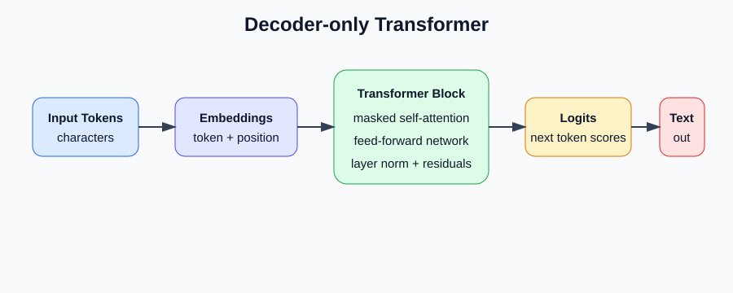

## Nano GPT Learning Project

This project was created to understand the working of transformer models and their core components by building a small character-level language model in PyTorch. It follows the nanoGPT style of learning: start with a bigram baseline, then add embeddings, masked self-attention, multi-head attention, feed-forward layers, layer normalization, residual connections, and text generation.



## Project Layout

- `src/bigram_language_model.py` - bigram baseline with loss evaluation and generation.
- `src/minimal_bigram_language_model.py` - smaller first-pass bigram script.
- `src/transformer_language_model.py` - decoder-only transformer language model.
- `data/tiny_shakespeare.txt` - text dataset used for training.
- `notebooks/transformer_experiment.ipynb` - exploratory notebook.
- `app/streamlit_app.py` - Streamlit app kept separately from the model scripts.
- `docs/images/` - diagrams used in this README.

## Run

Install dependencies with `uv`:

```bash
uv sync
```

Run the bigram baseline:

```bash
uv run python src/bigram_language_model.py
```

Run the transformer model:

```bash
uv run python src/transformer_language_model.py
```

The training scripts use `data/tiny_shakespeare.txt` and print generated text after training.
